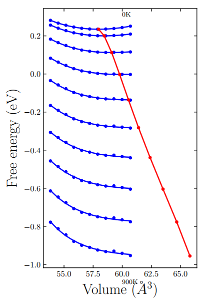

[toc]
## vasp代码部分
### 弛豫过程
```bash
PREC = High

IBRION = 2
NSW = 100
ISIF = 3

EDIFF = 1.0e-8
EDIFFG = -0.001

ISMEAR = 0     ! always well
SIGMA = 0.05      ! maybe well
```
> 对于闪锌矿和岩盐结构设置`ISIF = 7`

### 声子计算过程
#### INCAR
```bash
   PREC = Accurate
 IBRION = 8
  EDIFF = 1.0e-08
  IALGO = 38
 ISMEAR = 0; SIGMA = 0.05
  LREAL = .FALSE.
ADDGRID = .TRUE.
  LWAVE = .FALSE.
 LCHARG = .FALSE.
LEPSILON = .TRUE.
```
> 最简单的声子计算，未考虑自旋轨道耦合

#### job
```bash
#!/bin/bash
#PBS -m e
#PBS -l nodes=1:ppn=12
#PBS -l walltime=54:00:00
cd $PBS_O_WORKDIR

for i in {-5..5}
do
mkdir POSCAR-$i
cp POTCAR INCAR KPOINTS POSCAR-$i/
cd POSCAR-$i

j=`echo "scale=3;1+4*$i/1000"|bc`
cat > POSCAR <<!
Primitive Cell
   $j
    -2.8683790749450599    2.9248650645360104    1.6090996204241721
     2.8683790749450599   -2.9248650645360104    1.6090996204241721
     2.8683790749450599    2.9248650645360104   -1.6090996204241721
   Cd   Te
     1     1
Direct
  0.0336726707831663  0.0336726707831663 -0.0000000000000000
  0.3138273552168323  0.8138273552168327  0.5000000000000000
!

cat $PBS_NODEFILE > nodes
BIN=~/544-bin/vasp_std
mpirun -np 12 -machinefile nodes $BIN
cd ..
done
grep cm-1 POSCAR-{-5..5}/OUTCAR > output
```
> 最大体积变化为$ 1.02^3 $，放缩过大会导致出现过大的虚频

## 文献阅读结果
### 实验结果

> 链接标号有误，但是链接可正常跳转
| 原结构 | 转变结构 | 温度 | 压强 | 预测压强 |
| :--: | :--: | :-- | :-- | :-- |
| 闪锌矿 | 岩盐 | 室温 | 3.3GPa [^1] | 3.43GPa |
| 闪锌矿 | 朱砂 | 735K | 2.6GPa [^2] |   |
| 岩盐 | $ \beta $-Sn [^3] | 室温 | 10.33GPa | 20.39GPa |
| $ \beta $-Sn | orthorhombic [^4] | 室温 | 12.18GPa |  |

> 1. 空格表示未做出相应结构
> 2. 岩盐$ \rightarrow \beta $-Sn$ \rightarrow $orthorhombic被PRB文献验证相变有误，须修改

### 文献模拟结果
来自文献，使用MD模拟，并不能和实验对比[^5]

| 原结构 | 转变结构 | 温度 | 压强 | 预测压强 |
| :--: | :--: | :-- | :-- | :-- |
| 闪锌矿 | $ \beta $-Sn |   | 20GPa |    |
| $ \beta $-Sn | Imm2[^6] |   | 50GPa |   |

## QHA模拟
> 考虑了波恩有效电荷

### 计算结果部分

黑色表示闪锌矿，蓝色表示岩盐，黄色为I-4m2，红色为Imm2。


### 猜测问题所在
1. 低压以及0压造成高温时能量拟合不理想，致使压强计算不准，而能量差距本身不大

此图为rocksalt自由能拟合结果，可以看到高温时能量有所波动

此图为I-4m2和Imm2结构能量$ \lt $0.005eV对应位置，可以看到区域很大，说明能量相差不大，与此相反为下图，是岩盐和闪锌矿之间能量在相差$ \lt $0.005eV对应位置，区域较小。


2. 未考虑自旋轨道耦合

### 修正方式
1. 在vasp弛豫晶格时中加入PSTRESS，获得相应的结构，将对应的结构在加入对应PSTRESS的情况下计算声子能量，然后在phonopy中使用`--pressure`标签，进行能量修正

2. 加入LSORBIT


[^1]: Hu JZ (1987) Solid State Comm 63:471–474

[^2]: Martínez-García D, Le Godec Y, Mézouar M, Syfosse, Itié JP, Besson JM (1999) Phys Stat Sol (b) 211:461–467

[^3]: $ \beta $-Sn，白锡，I-4m2，tetragonal（四方晶系），结构为：


[^4]: orthorhombic（正交晶系），结构为（感觉有问题）：


[^5]: Alptekin, S. Structural phase transition of CdTe: an ab initio study. J Mol Model 19, 421–426 (2013)

[^6]: 


